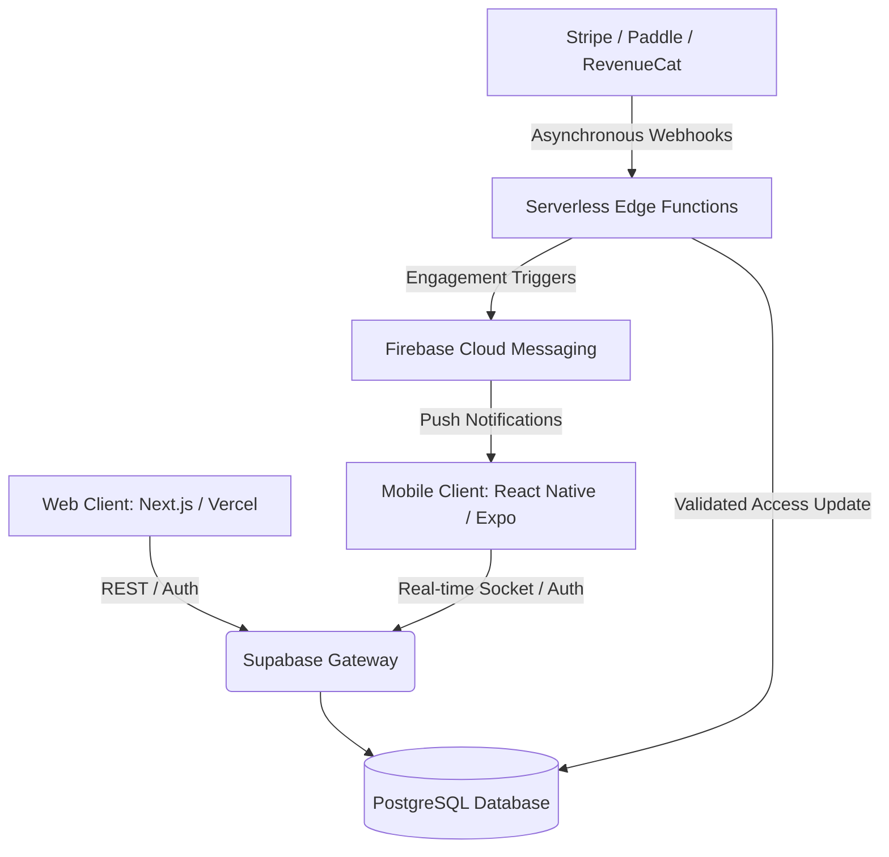

```mermaid
graph TD
    A[Web Client: Next.js / Vercel] -->|REST / Auth| C(Supabase Gateway)
    B[Mobile Client: React Native / Expo] -->|Real-time Socket / Auth| C
    C --> D[(PostgreSQL Database)]
    E[Stripe / Paddle / RevenueCat] -->|Asynchronous Webhooks| F[Serverless Edge Functions]
    F -->|Validated Access Update| D
    F -->|Engagement Triggers| G[Firebase Cloud Messaging]
    G -->|Push Notifications| B
```
